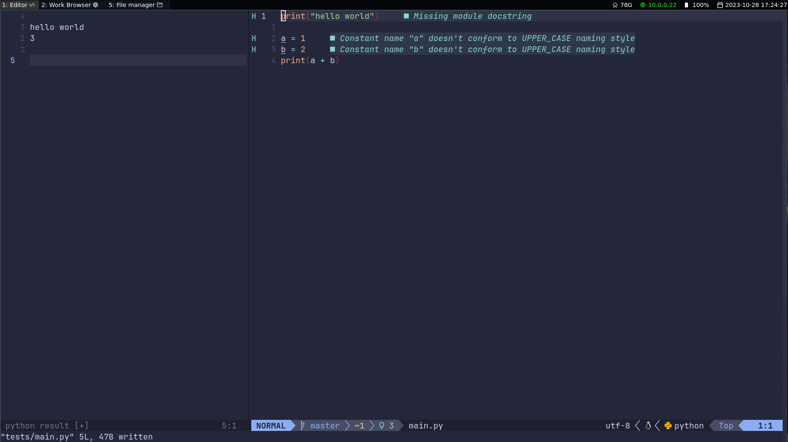
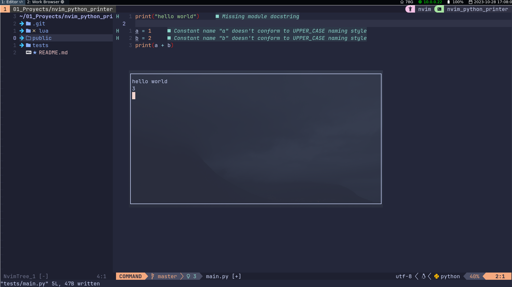

# nvim python printer

__nvim python printer__ is a very simple plugin that does as told, it shows you the result of a python script on neovim on save

## Dependencies

the only thing you need is python3
    
## installation

### Packer
```lua
use "adrianetp/nvim_python_printer"
```

### Lazy

```lua
{
    "adrianetp/nvim_python_printer"
    config = function()
        require("python_printer").setup()
    end
}
```

## Usage 

It is a really simple pluggin, just start saving files!! Just keep in mind it has a few ways of working depending on your enviroment

### No tmux
- without tmux, it will open a new buffer



### tmux

- on tmux, it will open a popup window with the python result 


